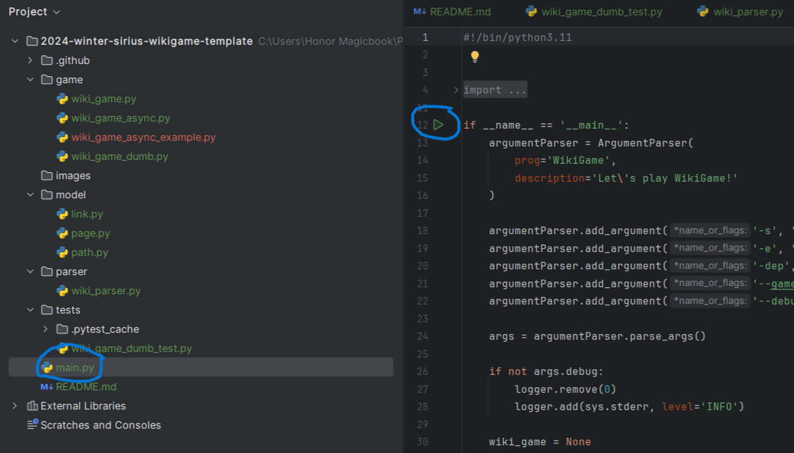
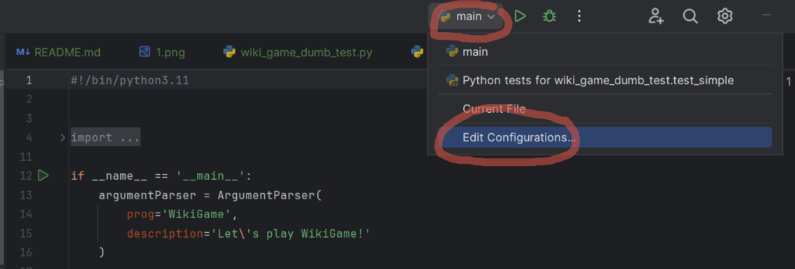
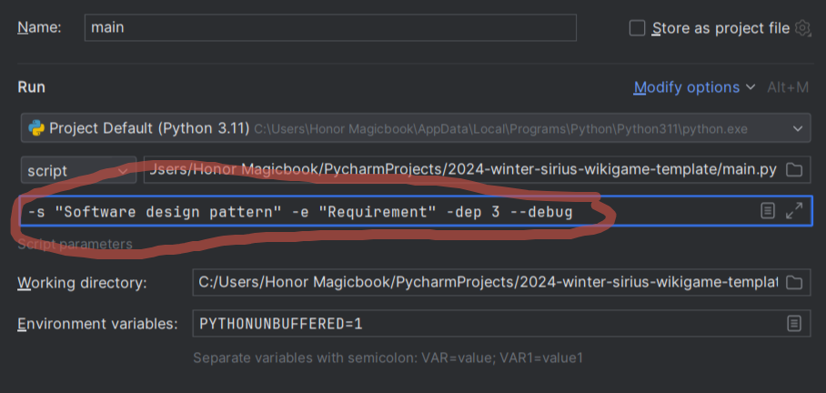
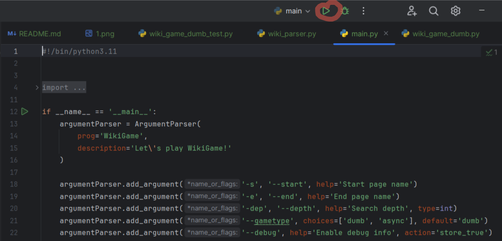

### Python 3.11
```bash
sudo add-apt-repository ppa:deadsnakes/ppa
sudo apt update 
sudo apt install python3.11
```

### Packages
```bash
python3.11 -m pip install loguru aiohttp beautifulsoup4
```

### Example configuration:
```bash
python3.11 main.py -s "Software design pattern" -e "Software engineering" -dep 3 --debug
```
This configuration will find the path between the page https://en.wikipedia.org/wiki/Software_design_pattern and https://en.wikipedia.org/wiki/Software_engineering.

Please note that the page names are set as they look on the pages, not in the address bar.

### How to work with project in PyCharm:
1. Find the file `main.py` and click the green arrow

2. Open the configuration section and select "Edit..."

3. Add script parameters (you can view the available options in main.py )

4. Close and use green arrow to run
